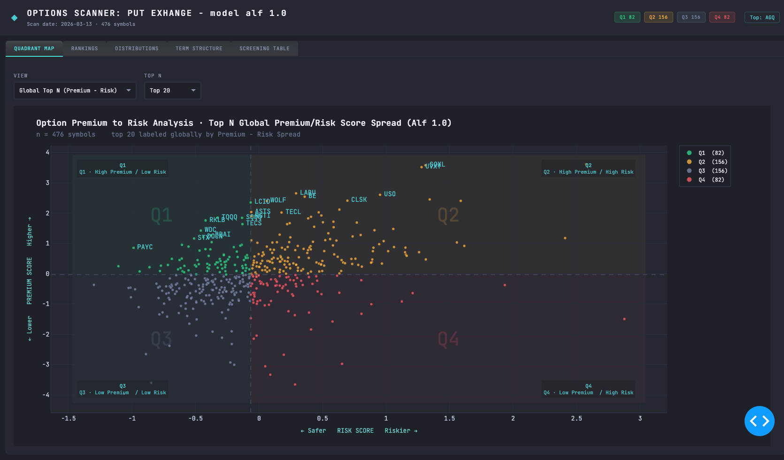

<!-- <div align="center">
  <a href="https://raw.githubusercontent.com/alfskoyen/options-alpha-scanner/main/assets/opt_scan_scatter_3.13.png">
    
  </a>
  <p><em>Figure: Premium to Risk Spread Scatter-Plot of Global Universe of Put Options.</em></p> 
</div> -->


> **Active development** — working pipeline scanning ~600 symbols. 
> Scoring methodology and dashboard under continuous iteration.

--- 

## Option Analytics / Put Option Alpha Analysis and Dashboard Project
&nbsp; A quantitative put-selling opportunity scanner across ~600 NYSE & Nasdaq symbols

Click to Review a Demo of the Options Premium & Risk Model · Live Screening Dashboard

<div align="center">

<a href="https://options-alpha-scanner.onrender.com" target="_blank">
  
</a>

<a href="https://options-alpha-scanner.onrender.com" target="_blank">
  
</a>

</div>


<!-- <div align="center">

[](https://options-alpha-scanner.onrender.com)

[](https://options-alpha-scanner.onrender.com) -->

---

</div>

<!-- [](https://options-alpha-scanner.onrender.com) -->

## Table of Contents

1. [Objective & North Star](#1-objective--north-star)
2. [Output & Dashboard](#2-output--dashboard)
3. [Two-Dimensional Model — Premium & Risk](#3-two-dimensional-model-—premium-&-risk)
4. [Scoring Model](#4-scoring-model)
5. [Pipeline Architecture](#5-pipeline-architecture)
6. [Data Sources & API Pipeline](#6-data-sources--api-pipeline)
7. [Key Assumptions](#7-key-assumptions)
8. [Repository Structure](#8-repository-structure)
9. [Configuration & Setup](#9-configuration--setup)

---
## 1. Objective & North Star
The core objective of this project is to systematically and directionally identify improved put-selling opportunities across the US equity universe on any given trading day. 
Rather than monitoring only a handful of exhange tickers using limited metrics, this framework builds a two-dimensional viewpoint for every symbol scoring a) how much premium is available in comparison to the present market and volatility profile and b) how much risk is embedded in the vol environment, quickly scoring and placing the global set into a quadrant based profile. 

**Our north star is Q1: High Premium / Low Risk.**

These are symbols where the options market is offering meaningful premium relative to spot price, while the underlying volatility environment does not justify exceptional caution. 
They represent the best asymmetric put-selling setups, by first being paid well for risk that, on a relative basis, is below the universe median.

The framework is intentionally cross-sectional. Every score is relative to the scanned universe on that specific date, not absolute. A premium score of 0.85 means the symbol is in the 85th percentile of the universe — not that it meets some fixed threshold. This makes the model self-calibrating across different vol regimes.

---

## 2. Output & Dashboard

### Master DataFrame

One row per symbol, approximately 100+ columns including:

- `symbol`, `date`, `spot`
- `premium_{bucket}_{dte}` — normalized put premium per bucket/DTE (16 columns)
- `iv_{bucket}_{dte}` — average IV per bucket/DTE (16 columns)
- `straddle_{dte}`, `put_atm_{dte}`, `call_atm_{dte}` — straddle components (12 columns)
- `prem_per_iv_primary_{dte}`, `prem_per_iv_sec_{dte}`, `prem_per_hv30_{dte}` — efficiency (12 columns)
- `HV_20`, `HV_30`, `HV_60` — realized vol
- `atm_iv_{dte}`, `ratio_{dte}`, `spread_{dte}`, `signal_{dte}` — IV/HV per DTE (16 columns)
- `spike_*_30`, `spike_*_60` — spike metrics both windows
- `relative_vol_spy`, `relative_vol_qqq` — benchmark-relative vol
- `premium_score`, `risk_score`, `quadrant` — composite scores
- `prem_efficiency_signal_{dte}` — categorical signal per DTE
- `spike_signal_universe`, `spike_pct_universe` — universe-relative spike
- `HV_30_pct`, `relative_vol_spy_pct`, `relative_vol_qqq_pct` — percentile ranks
- `premium_slope`, `iv_slope`, `slope_divergence`, `slope_div_pct` — term structure

### CSV Output

Saved as `data/scored_master_{option_date}.csv` — one file per run, date-stamped for run tracking.

---

### Dashboard

Scoring and metric outputs from the model are visualized across a five-section interactive 
dashboard built in Plotly. The dashboard is designed to move from the macro universe view 
down to individual symbol detail — starting with where every symbol sits in the two-dimensional 
scoring space, then drilling into ranked opportunity lists, term structure patterns, and raw 
metric tables for deeper due diligence.

---

### Global Universe Scatter — Premium vs Risk

The primary view places every symbol in the scanned universe onto the two-dimensional 
premium/risk plane. Each point is colored by quadrant — Q1 (mint, target), Q2 (amber, 
rich but risky), Q3 (steel, low opportunity), Q4 (red, avoid). Quadrant dividers are drawn 
at the universe median on each axis. The top symbols by combined score are labeled directly 
on the chart, making the best setups immediately visible without any filtering. Hovering over 
any point surfaces key metrics including IV/HV ratio, spike signal, relative vol vs SPY, 
straddle premium, and term structure divergence.

<!-- <div align="center">

<p><em>Figure 1: Premium vs Risk scatter across the full ~600 symbol universe. Each point 
represents one symbol, colored by quadrant. Q1 (top-left) symbols offer the highest premium 
relative to their risk score — the primary target zone for put-selling.</em></p>
</div> -->

<div align="center">
  <a href="https://raw.githubusercontent.com/alfskoyen/options-alpha-scanner/main/assets/opt_scan_scatter_3.13.png">
    
  </a>
  <p><em>Figure 1: Premium vs Risk scatter across the full ~600 symbol universe. Each point 
represents one symbol, colored by quadrant. Q1 (top-left) symbols offer the highest premium 
relative to their risk score — the primary target zone for put-selling.</em></p>
</div>

---

### Ranked Bar Charts — Preset Scenarios

A suite of horizontal bar charts rank symbols by specific metrics across user-defined 
scenarios — highest premium score, lowest risk score, highest straddle premium, steepest 
term structure divergence, and per-quadrant deep dives. Each bar is colored by the symbol's 
quadrant so the risk context is immediately visible alongside the ranking. Rich hover data 
surfaces IV/HV ratio, spike signal, and premium efficiency metrics without leaving the chart, 
enabling rapid triage across dozens of candidates.

<!-- <div align="center">

<p><em>Figure 2: Ranked bar chart view showing the lowest risk score symbols across the 
universe. Bar color reflects quadrant membership — Q1 names (mint) in a low-risk ranking 
represent the cleanest put-selling setups where premium and safety align.</em></p>
</div> -->

<div align="center">
  <a href="https://raw.githubusercontent.com/alfskoyen/options-alpha-scanner/main/assets/opt_scan_bar_prem_3.13.png">
    
  </a>
  <p><em>Figure 2: Ranked bar chart view showing the lowest risk score symbols across the 
universe. Bar color reflects quadrant membership — Q1 names (mint) in a low-risk ranking 
represent the cleanest put-selling setups where premium and safety align.</em></p>
</div>

---

### Global Distributions — Universe Metric Histograms

The distributions panel provides a macro-level view of how key metrics are spread across 
the full universe — premium levels, HV, IV/HV ratios, and spike activity. Histograms make 
it immediately visible whether the current vol environment is broadly elevated or compressed, 
whether premium is concentrated in a few outlier symbols or evenly distributed, and where 
a specific symbol sits on each curve relative to the population. This view is particularly 
useful for calibrating expectations — a symbol with `HV_30_pct = 0.92` reads very 
differently when you can see the full distribution shape behind it.

<!-- <div align="center">

<p><em>Figure 3: Histogram distributions of key risk and premium metrics across the full 
universe. The shape of these distributions shifts with the vol regime — compressed 
distributions indicate a calm market, fat right tails indicate elevated fear or idiosyncratic 
stress concentrated in specific sectors.</em></p>
</div> -->

<div align="center">
  <a href="https://raw.githubusercontent.com/alfskoyen/options-alpha-scanner/main/assets/opt_scan_histo_risk_3.13.png">
    
  </a>
  <p><em>Figure 3: Histogram distributions of key risk and premium metrics across the full 
universe. The shape of these distributions shifts with the vol regime — compressed 
distributions indicate a calm market, fat right tails indicate elevated fear or idiosyncratic 
stress concentrated in specific sectors.</em></p>
</div>

---

### Term Structure View — ATM Premium Slope by Quadrant

The term structure panel surfaces how premium and IV grow as expiration extends from 14 
to 90+ days. Steeper premium slopes indicate more reward for selling further-dated options. 
The slope divergence metric — premium slope minus IV slope — identifies symbols where 
premium is outpacing what the vol environment implies, flagging underpriced term structure 
as an additional opportunity signal. Views are filterable by quadrant, allowing focused 
analysis within Q1 or Q2 names specifically.

<!-- <div align="center">

<p><em>Figure 3: Term structure view showing ATM premium across DTE windows for top Q1 
symbols. Steeper slopes indicate greater reward for selling longer-dated options. The 
divergence between premium slope and IV slope is the key signal — positive divergence 
means the market is paying above what vol implies.</em></p>
</div> -->

<div align="center">
  <a href="https://raw.githubusercontent.com/alfskoyen/options-alpha-scanner/main/assets/opt_scan_term_q3_atm_prem_3.13.png">
    
  </a>
  <p><em>Figure 4: Term structure view showing ATM premium across DTE windows for top Q1 
symbols. Steeper slopes indicate greater reward for selling longer-dated options. The 
divergence between premium slope and IV slope is the key signal — positive divergence 
means the market is paying above what vol implies.</em></p>
</div>

---

### Raw Metrics Table

The metrics table provides full access to the underlying data for any symbol — every 
premium bucket, IV/HV ratio, spike metric, efficiency signal, and percentile rank in a 
single scrollable view. Sortable by any column, the table supports manual due diligence 
on any candidate surfaced by the scatter or bar views. The `prem_efficiency_signal` 
categorical columns per DTE window give an at-a-glance summary of whether each expiration 
window is Rich or Cheap, Efficient or Thin.

<!-- <div align="center">

<p><em>Figure 4: Full metrics table showing all scoring outputs per symbol. Sortable by any 
column — premium buckets, IV/HV ratios, spike signals, term structure slopes, and efficiency 
metrics are all accessible for manual review and validation of model-surfaced candidates.</em></p>
</div> -->

<div align="center">
  <a href="https://raw.githubusercontent.com/alfskoyen/options-alpha-scanner/main/assets/opt_scan_table_3.13.png">
    
  </a>
  <p><em>Figure 5: Full metrics table showing all scoring outputs per symbol. Sortable by any 
column — premium buckets, IV/HV ratios, spike signals, term structure slopes, and efficiency 
metrics are all accessible for manual review and validation of model-surfaced candidates.</em></p>
</div>

---
## 3. Two-Dimensional Model — Premium & Risk

The core of the framework is a two-dimensional scoring model. Every symbol in the universe 
is evaluated on two independent axes; how much premium is available, and how worrisome is the 
vol environment. The scoring method places each symbol into one of four quadrants based on its position relative to 
the universe median on each axis.
```
                    HIGH PREMIUM
                         │
          Q2             │             Q1
    High Premium         │       High Premium
     High Risk           │        Low Risk  ← target
                         │
  ───────────────────────┼───────────────────────
                         │
          Q4             │             Q3
    Low Premium          │        Low Premium
     High Risk           │         Low Risk
                         │
                     LOW PREMIUM
```

*The two sub-layers below — Premium (4a) and Risk (4b) — describe how each axis is built
from raw API data before the scores are combined in the Scoring Model (Section 5).*


### 3a. _Premium Dimension_

### DTE Windows

Four days-to-expiration windows are targeted per symbol, attempting consistency across the global set. 

| Window | Selection Method |
|---|---|
| 14-day | Weekday-aware Friday snapping — Mon/Tue/Wed → next Friday, Thu/Fri → Friday after next |
| 30-day | Mechanical offset, nearest chain expiry within ±13 days |
| over60_1 | First standard expiration beyond 60 days (auto-discovered from chain) |
| over60_2 | Second standard expiration beyond 60 days |

### Delta-Based Strike Buckets

Contracts are bucketed by `abs(delta)` rather than price distance from spot. This equalizes strike selection across the universe — a 0.20 delta put on a high-vol stock and a low-vol stock both represent approximately 20% probability of expiring ITM, regardless of the very different price distances involved.

| Bucket | Delta Range | Probability ITM |
|---|---|---|
| ATM | 0.40 – 0.60 | ~50% |
| Slight | 0.25 – 0.40 | ~25–40% |
| Moderate | 0.15 – 0.25 | ~15–25% |
| Far | 0.05 – 0.15 | ~5–15% |

### Liquidity Filters

Open interest thresholds are applied per bucket: 
- ATM contracts require zero Option Interest (OI) (vega filter only) since OI=0 on a given day does not indicate illiquidity for near-the-money contracts.
- Far OTM requires meaningful OI to filter genuinely untradeable strikes.

| Bucket | Min OI |
|---|---|
| ATM | 0 (vega ≥ 0.001 only) |
| Slight | 1 |
| Moderate | 3 |
| Far | 5 |

### Premium Normalization

All premium values are expressed as `extrinsic_value / spot_price` — this makes premium directly comparable across any ticker regardless of price level. 
A `premium_atm_30 = 2.5` means the ATM 30-day put collects 2.5% of the stock's current price.

### Premium Efficiency Metrics

Three metrics normalize premium relative to the vol environment:

| Metric | Formula | Interpretation |
|---|---|---|
| `prem_per_iv_primary` | `straddle / (ATM_IV × √(DTE/252))` | Near 1.0 = fair value. Above 1.0 = collecting more than IV implies |
| `prem_per_iv_sec` | `put_atm / ATM_IV` | Premium per point of implied vol |
| `prem_per_hv30` | `put_atm / HV_30` | Premium per point of realized vol |

### Premium Efficiency Signal

Each DTE window receives a categorical label combining IV/HV ratio and efficiency:

| Signal | Condition |
|---|---|
| Rich + Efficient | ratio ≥ 1.20 AND prem_per_iv ≥ 0.60 |
| Rich + Thin | ratio ≥ 1.20 AND prem_per_iv < 0.60 |
| Cheap + Efficient | ratio < 1.20 AND prem_per_iv ≥ 0.60 |
| Cheap + Thin | ratio < 1.20 AND prem_per_iv < 0.60 |


### _3b. Risk Dimension_

### Historical Volatility

Computed from daily log returns on closing prices, annualized with √252:

```
HV_N = std(log(P_t / P_{t-1}), window=N) × √252
```

Three windows: HV_20, HV_30, HV_60. The series is truncated at `as_of_date` to prevent any lookahead from future prices entering the calculation.

### IV/HV Ratios

ATM IV from the options chain is compared to HV_30 (primary benchmark) per DTE window:

| Signal | Ratio |
|---|---|
| Very Rich | ≥ 1.50 |
| Rich Vol | ≥ 1.20 |
| Equiv. Vol | ≥ 0.90 |
| Compressed Vol | ≥ 0.70 |
| Discounted Vol | < 0.70 |

### Spike Analysis

A spike is defined as any day where `|log_return| > 2σ` of that window's own standard deviation — self-normalizing so each stock is measured against its own recent behavior.

Two windows are run: 30-day and 60-day. The spike ratio compares observed spikes to the expected count under normality (4.55% of days expected to exceed 2σ).

**Universe-relative spike signal** is computed in the scoring layer by blending frequency × log(magnitude) across both windows and ranking percentile vs the full universe:

```
spike_score = 0.7 × (spike_ratio_30 × log1p(avg_spike_pct_30))
            + 0.3 × (spike_ratio_60 × log1p(avg_spike_pct_60))
```

### Relative Volatility

`HV_30` for each symbol is divided by SPY's `HV_30` and QQQ's `HV_30` (computed once before the loop):

```
relative_vol_spy = symbol_HV_30 / spy_HV_30
```

Values above 1.0 mean the symbol is moving more than the broad market. This separates idiosyncratic vol from systematic vol — a stock moving 3× SPY in the same market environment carries fundamentally different put-selling risk than one moving 1.2×.

---

## 4. Scoring Model

### Premium Score

Combines a raw premium composite and an efficiency composite, both standardized:

```
raw_score = Σ (DTE_weight × Σ (bucket_weight × premium_{bucket}_{dte}))
eff_score = Σ (DTE_weight × prem_per_iv_primary_{dte})

premium_score = StandardScaler(0.60 × raw_score + 0.40 × eff_score)
```

**DTE weights** (shorter term weighted higher — theta focus):

| DTE | Weight |
|---|---|
| 14 | 0.50 |
| 30 | 0.30 |
| over60_1 | 0.15 |
| over60_2 | 0.05 |

**Strike bucket weights** (rewards OTM premium — ATM is always available, the signal is in Slight/Moderate):

| Bucket | Weight |
|---|---|
| ATM | 0.20 |
| Slight | 0.40 |
| Moderate | 0.30 |
| Far | 0.15 |

### Risk Score

Four components standardized and weighted:

```
risk_score = 0.20 × iv_hv_component
           + 0.25 × hv_30_component
           + 0.40 × spike_component
           + 0.15 × slope_component
```

| Component | Construction | Direction |
|---|---|---|
| iv_hv_ratio | Asymmetric — IV < HV penalized 2× harder (cheap IV = dangerous complacency) | Higher = more risk |
| hv_30 | Raw HV_30 value — absolute vol level | Higher = more risk |
| spike_ratio | Blended 30/60d frequency × log(magnitude) | Higher = more risk |
| slope | ratio_14 − ratio_over60_1 — inverted term structure signals near-term stress | Higher = more risk |

### Quadrant Assignment

Median split on both axes across the scanned universe:

| Quadrant | Condition | Interpretation |
|---|---|---|
| Q1 High Premium / Low Risk | premium ≥ median AND risk < median | Target — best put-selling setups |
| Q2 High Premium / High Risk | premium ≥ median AND risk ≥ median | Premium available but vol environment is dangerous |
| Q3 Low Premium / Low Risk | premium < median AND risk < median | Safe but nothing to collect |
| Q4 Low Premium / High Risk | premium < median AND risk ≥ median | Avoid |

### Term Structure

Linear regression slope of bucket-weighted premium and ATM IV across all 4 DTE windows, using nominal DTE values as x-axis `[14, 30, 63, 91]`. Requires minimum 3 of 4 DTE windows populated.

```
slope_divergence = premium_slope − iv_slope
```

Positive divergence means premium is growing faster across DTE than IV implies — an opportunity signal. All slopes are percentile-ranked vs universe.


---
## 5. Pipeline Architecture

The pipeline is multi-phased and accomplishes several data capture, wrangilng and creation setps in four sequential layers:

```
┌─────────────────────────────────────────────────────┐
│  1. API LAYER           av_api_calls.py             │
│     Alpha Vantage → options chain + daily prices    │
│     Rate-limited batching, error handling           │
│     SPY/QQQ benchmark HV computed once pre-loop     │
└────────────────────┬────────────────────────────────┘
                     │
┌────────────────────▼────────────────────────────────┐
│  2. PREMIUM LAYER   option_prem_iv_builder.py       │
│     Delta-bucketed put/call premium per DTE window  │
│     ATM straddle + 3 efficiency metrics             │
│     Normalized by spot price (cross-ticker)         │
└────────────────────┬────────────────────────────────┘
                     │
┌────────────────────▼────────────────────────────────┐
│  3. RISK LAYER      hist_vol_iv_risk_builder.py     │
│     HV_20 / HV_30 / HV_60 from daily log returns    │
│     IV/HV ratios per DTE window                     │
│     Spike analysis — self-relative + universe       │
│     Relative vol vs SPY and QQQ                     │
└────────────────────┬────────────────────────────────┘
                     │
┌────────────────────▼────────────────────────────────┐
│  4. SCORING LAYER   score_universe.py               │
│     Premium Score + Risk Score (StandardScaler)     │
│     Term structure regression slopes                │
│     Premium efficiency signals per DTE              │
│     Quadrant assignment (median split)              │
│     Universe-relative percentile ranks              │
└─────────────────────────────────────────────────────┘
```

---

## 6. Data Sources & API Pipeline

### Data Source

**Alpha Vantage Premium API** — two endpoints per symbol per run:

| Endpoint | Purpose | Key Fields Used |
|---|---|---|
| `HISTORICAL_OPTIONS` | Options chain snapshot for a specific date | strike, bid, ask, IV, delta, vega, OI, expiration |
| `TIME_SERIES_DAILY` | Daily closing prices for HV computation | `4. close` |

---

#### `TIME_SERIES_DAILY` — Response Structure

*Two top-level keys are returned. `Meta Data` describes the request context.
`Time Series (Daily)` contains the price history keyed by date string,
newest first. Only `4. close` is used — pulled at `as_of_date` for spot price
and across the full compact window (100 days) for HV computation.*
```python
dict_keys(['Meta Data', 'Time Series (Daily)'])
```

**Meta Data**
```json
{
    "1. Information": "Daily Prices (open, high, low, close) and Volumes - DATA DELAYED BY 15 MINUTES",
    "2. Symbol":      "TQQQ",
    "3. Last Refreshed": "2026-03-20",
    "4. Output Size": "Compact",
    "5. Time Zone":   "US/Eastern"
}
```

**Time Series (Daily)** — *one entry per trading day, newest first*
```json
{
    "2026-03-20": {
        "1. open":   "45.1800",
        "2. high":   "45.2100",
        "3. low":    "42.3000",
        "4. close":  "43.0800",
        "5. volume": "137952495"
    },
    "2026-03-19": {
        "1. open":   "44.8700",
        "2. high":   "46.3200",
        "3. low":    "44.3000",
        "4. close":  "45.6900",
        "5. volume": "138384909"
    }
}
```

> **Pipeline usage:** `spot = float(daily_data['Time Series (Daily)'][as_of_date]['4. close'])`
> HV is computed from the full series via `parse_daily_closes()` which truncates at `as_of_date`.


### API Design Decisions

**Historical vs Realtime options:** `HISTORICAL_OPTIONS` is used rather than `REALTIME_OPTIONS` because it allows point-in-time analysis with a specific `date` parameter — critical for backtesting and for ensuring the HV window and options chain are synchronized to the same date.

**`outputsize=compact`:** Returns the last 100 trading days of price history — sufficient for HV_60 (60 trading days minimum) while keeping API response times fast.

**Spot price derivation:** Spot is pulled from `TIME_SERIES_DAILY` at the `as_of_date` close, not from the options chain. This ensures the spot used for normalization is the actual closing price, not an inferred mid-market from the chain.

**Rate limiting:** Alpha Vantage Premium allows 75 calls/minute. Each symbol requires 2 calls (options + prices). The loop batches 37 symbols per minute with a 61-second pause between batches.

**Benchmark pre-fetch:** SPY and QQQ are fetched once before the main loop. Their `HV_30` values are used to compute `relative_vol_spy` and `relative_vol_qqq` for every symbol in the universe — adding these to the loop would cost 4 extra calls per symbol.

**Error handling:** Failed symbols are logged to `error_log_df` with the raw AV response keys captured — distinguishing between rate limit responses (`Information` key), per-minute throttles (`Note` key), and invalid symbols (`Error Message` key).

---

## 7. Key Assumptions

### Premium Assumptions

- **Extrinsic value only** — intrinsic value is subtracted. The metric is what you actually collect as time premium, not total option price.
- **Mid-price** — `(bid + ask) / 2` used rather than last trade, which can be stale.
- **Delta bucketing is stable within a session** — delta shifts intraday but for end-of-day snapshot analysis, the delta at close accurately represents the moneyness distribution.
- **ATM put-call parity near spot** — straddle is computed as put_atm + call_atm. Near the money, put and call IV should converge. Wide divergence flags potential data quality issues.

### Volatility Assumptions

- **Log-normality** — HV is computed from log returns, consistent with Black-Scholes. The √252 annualization assumes 252 trading days per year.
- **EWMA not used for mean** — EWMA mean estimates are noise-dominated. The HV calculation uses rolling standard deviation with zero mean assumption, consistent with practitioner convention.
- **HV_30 as primary benchmark** — 30-day realized vol is the most directly comparable window to the most liquid options (30-DTE). HV_20 and HV_60 provide context but HV_30 drives the IV/HV ratio.
- **as_of_date truncation** — price history is truncated at the option snapshot date. This is strictly enforced to prevent lookahead — no future returns can enter the HV calculation.

### Spike Assumptions

- **2σ threshold** — under normality, approximately 4.55% of days should exceed 2σ. This gives the expected_count baseline. Ratios above 1.0 mean more spikes than expected.
- **Self-normalizing** — each stock's threshold is set by its own window standard deviation, not a fixed absolute threshold. This means a 3% move on a calm stock and a 10% move on a volatile stock can both be spikes — what matters is deviation from recent behavior.
- **30-day window weighted higher** (0.70) than 60-day (0.30) in the blended universe score — more recent activity is more relevant for put-selling decisions.

### API / Data Assumptions

- **Point-in-time consistency** — `option_date` and `as_of_date` are set to the same date. The options chain and the HV calculation both anchor to the same closing snapshot.
- **AV historical options availability** — not all symbols have complete historical chains. Symbols with missing data are logged to `error_log_df` and excluded from the master.
- **Compact time series = 100 days** — sufficient for HV_60 with buffer. If a symbol has fewer than 60 trading days of history the HV_60 will be NaN but HV_20 and HV_30 may still be valid.
- **SPY/QQQ as benchmark** — SPY represents the broad market (used as primary relative vol benchmark). QQQ represents the Nasdaq-heavy subset relevant for tech names. Both are fetched once to avoid adding 4 calls per symbol to the run.

---

## 8. Repository Structure

```
repo/
├── notebooks/
│   └── options_analysis_pipeline.ipynb
├── src/
│   ├── av_api_calls.py                  # API layer + scan loop
│   ├── option_prem_iv_builder_V.py      # premium layer
│   ├── hist_vol_iv_risk_builder_III.py  # risk/HV layer
│   └── score_universe_IV.py             # scoring layer
├── data/                                # scored CSV outputs
├── assets/                              # images for dashboard/README
├── charts/                              # chart outputs
├── app_screener.py                      # dashboard app
├── data_prep.py                         # data prep utilities
├── theme.py                             # dashboard theme
├── Procfile
├── render.yaml
├── requirements.txt
└── README.md
```

---

## 9. Configuration & Setup

### Key Parameters

```python
# av_api_calls.py
option_date  = '2026-02-27'   # options chain snapshot date
as_of_date   = '2026-02-27'   # HV history truncation date
BATCH_SIZE   = 37             # symbols per rate-limit batch
PAUSE_SECS   = 61             # seconds between batches

# option_prem_iv_builder_V.py
DELTA_BUCKETS = {
    'ATM':      (0.40, 0.60),
    'Slight':   (0.25, 0.40),
    'Moderate': (0.15, 0.25),
    'Far':      (0.05, 0.15),
}
DTE_TOLERANCE = 13            # ± days to match chain expiry to target DTE

# score_universe_IV.py
RATIO_RICH_THRESHOLD = 1.20   # IV/HV above this = "Rich"
PREM_EFF_THRESHOLD   = 0.60   # prem_per_iv above this = "Efficient"
```

### Requirements

```
pandas
numpy
scipy
scikit-learn
requests
python-dotenv
plotly
ipython
```

### Environment

```bash
# .env file
ALPHA_VANTAGE_API_KEY=your_key_here
```

---
*Built for systematic put-selling opportunity identification across the US equity universe.*


